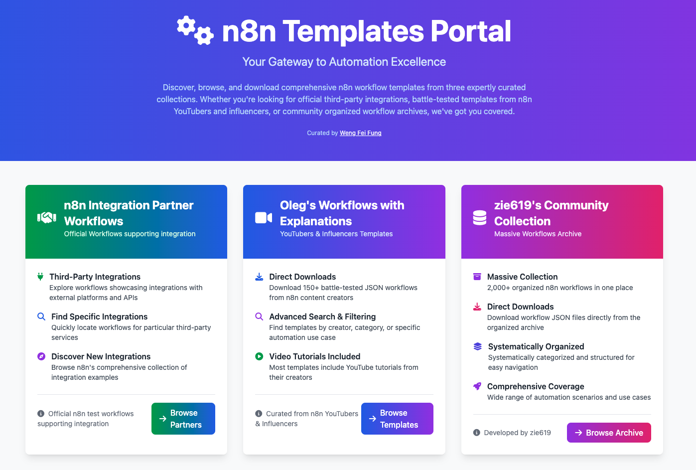
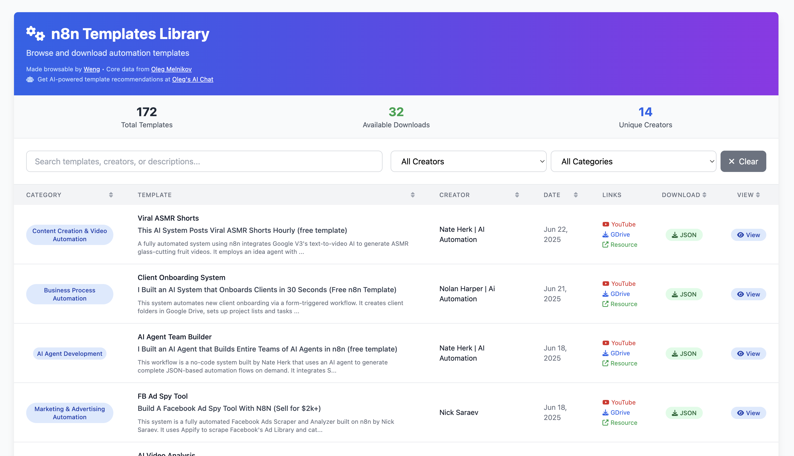

# n8n Workflow Template Portal

By Weng Fei Fung. 

## 🚀 Your Gateway to Automation Excellence

Welcome to the **n8n Templates Portal** - a comprehensive hub that brings together three expertly curated collections of n8n workflow templates. **Weng has created browser interfaces for n8n official integration workflows and oleg's workflows** to make them more accessible and searchable. Whether you're looking for official third-party integrations, battle-tested templates from content creators, or massive community archives, we've got you covered.

## 🌟 Three Powerful Collections

### 🤝 [n8n Integration Partner Workflows](n8n-partners/)
**Official Third-Party Integration Workflows**

Browse n8n's official test-workflows repository focusing on third-party integrations and partner services. **Weng has created a browser interface** to make these workflows easily accessible and searchable.

**Key Features:**
- **Find Specific Integrations**: Quickly locate workflows for particular third-party services
- **Discover New Integrations**: Explore n8n's comprehensive collection of integration examples
- **Official Quality**: Real-world examples from n8n's official repository
- **Partner Services**: Integrations with CrateDB and many other partner platforms

Perfect for developers who need reliable, officially-tested integration workflows.

---

### 🎥 [Oleg's Workflows with Explanations](oleg-browser/)
**YouTubers & Influencers Templates Collection**

A beautiful, searchable web interface featuring 150+ battle-tested templates from n8n content creators and influencers, sourced from Oleg Melnikov's comprehensive collection. **Weng has created this browser interface** to make Oleg's templates easily accessible with advanced search and filtering capabilities.

**Key Features:**
- **🔍 Advanced Search & Filtering**: Search by template name, creator, description, or category
- **⬇️ Direct Downloads**: Download JSON workflow files directly
- **👁️ Template Preview**: View template JSON structure in modal popup
- **🎥 Video Tutorials**: Most templates include YouTube tutorials from their creators
- **📱 Responsive Design**: Works perfectly on all devices
- **🤖 AI-Powered Help**: Get recommendations at [Oleg's AI Chat](https://olegfuns.app.n8n.cloud/webhook/cda21b26-b940-4b60-8afa-fd7b8281a96b/chat)

Perfect for learning from experienced n8n practitioners and getting video explanations.

---

### 🗃️ zie619's Community Collection
**Massive Workflows Archive** *(Coming Soon)*

A systematically organized collection of 2,000+ n8n workflows developed and **browsed through zie619's own interface**, providing the most comprehensive coverage of automation scenarios and use cases.

**Key Features:**
- **Massive Scale**: 2,000+ organized workflows in one place
- **Systematic Organization**: Categorized and structured for easy navigation
- **Direct Downloads**: Download workflow JSON files directly
- **Comprehensive Coverage**: Wide range of automation scenarios and use cases
- **Community Driven**: Developed and maintained by the community

Perfect for finding specific use cases and discovering new automation possibilities.

## 🎯 Quick Start

1. **Visit the Portal**: Open `index.php` in your web browser
2. **Choose Your Collection**: Select from the three available collections
3. **Browse & Search**: Use the built-in search and filtering capabilities
4. **Download Templates**: Get the JSON files you need
5. **Import to n8n**: Import downloaded templates into your n8n instance

## 📊 Collection Overview

| Collection | Templates | Focus | Best For |
|------------|-----------|-------|----------|
| **n8n Partners** | Official Test Workflows | Third-party Integrations | Enterprise & API Integrations |
| **Oleg's Collection** | 150+ | YouTuber Templates | Learning & Video Tutorials |
| **zie619's Archive** | 2,000+ | Community Workflows | Comprehensive Use Cases |

## 🛠️ Technical Requirements

- **PHP 8.4+** with session support
- **Web Server** (Apache, Nginx, or PHP built-in server)
- **Modern Browser** for the best experience

## 🤝 Contributing

This portal is maintained by Weng Fei Fung. For questions, suggestions, or contributions:
- 🐙 [GitHub Issues](https://github.com/Siphon880gh/n8n-templates/issues)
- 💼 [LinkedIn](https://www.linkedin.com/in/weng-fung/)
- 🎥 [YouTube Channel](https://www.youtube.com/@WayneTeachesCode/)

## 📄 License

This project is designed to make n8n templates more accessible to the community. Individual templates may have their own licenses as specified by their original creators.

---

**Made with ❤️ by Weng Fei Fung** | *Your Gateway to n8n Automation Excellence*