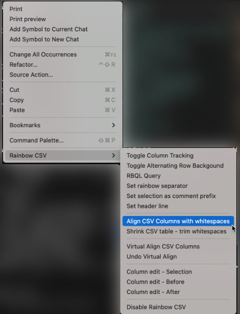

# n8n Workflow Template Library (Oleg)


<a target="_blank" href="https://github.com/Siphon880gh" rel="nofollow"></a>
<a target="_blank" href="https://www.linkedin.com/in/weng-fung/" rel="nofollow"></a>
<a target="_blank" href="https://www.youtube.com/@WayneTeachesCode/" rel="nofollow"></a>

By Weng Fei Fung. A beautiful, searchable web interface for browsing and downloading n8n automation templates. This project makes [Oleg Melnikov's comprehensive n8n templates collection](https://docs.google.com/spreadsheets/d/1v8aRvHQBwglhdWrpoCNE9fzptiCc23UxQvuhgr2RlIM/edit?gid=0#gid=0) easily accessible through a modern web application. Here is a [video](https://www.youtube.com/watch?v=yAiCXyGLZ2c) of him explaining his collection. He has also developed an [AI Chatbot]( https://olegfuns.app.n8n.cloud/webhook/cda21b26-b940-4b60-8afa-fd7b8281a96b/chat) to search the templates.

I found it preferable to have an actual search engine with filtering and sorting, so I created the browsable interface:


I also created the downloader script that will download the json from the Google Drive links in Oleg's database, making the workflows instantly viewable and downloadable from the browsable interface.

## 🌟 Features

- **🔐 Secure Login System** - Password-protected access to the templates library. There is a switch to enable or disable password-protection at the top of `index.php`.
- **🔍 Advanced Search & Filtering** - Search by template name, creator, description, or category
- **📊 Real-time Statistics** - View total templates, available downloads, and unique creators
- **⬇️ Direct Downloads** - Download JSON workflow files directly
- **👁️ Template Preview** - View template JSON structure in a modal popup
- **📱 Responsive Design** - Works perfectly on desktop, tablet, and mobile devices
- **🎨 Modern UI** - Beautiful gradient design with smooth animations and transitions
- **📋 Copy to Clipboard** - Easy copying of template JSON for import into n8n

## 🎯 Data Source

The core template data is sourced from Oleg Melnikov's comprehensive n8n templates collection, uploaded on June 20th, 2025. This collection contains hundreds of n8n automation workflows covering various use cases and integrations snapshotted on June 25th, 2025.


### 🤖 AI-Powered Template Recommendations

For personalized template recommendations and assistance, visit [Oleg's AI Chat](https://olegfuns.app.n8n.cloud/webhook/cda21b26-b940-4b60-8afa-fd7b8281a96b/chat) where you can get AI-powered suggestions for the perfect n8n template for your needs.


## 🖥️ Accessible Dashboard

Weng has made a browsable web interface for the templates


## 💽 More Accessible Templates

Weng has also fetched and downloaded each n8n template file so you can download or view  the template at the web interface. You also have access to the downloader script in case the original database continues to be updated and you want a script to fetch the copies into the web interface as well. The web interface automatically detects the template files which should be named after the ID (see original database for the ID) and then displays a Download or View button.

Downloader script in action:
- Notice some files are downloaded with suffix `_1`, `_2`, etc. This is because some template_url actually have multiple n8n templates. If you watch the youtube video for that resource, it may have covered multiple different types of workflows OR may have covered those workflows as working together (For example, one workflow executes another workflow).


Example of downloaded n8n template json file:


After the downloader script is done, you should see a report like this in the terminal:
```
=== Download Summary ===
Total downloads: 96
Total errors: 0
Files saved to: /Users/wengffung/dev/web/templates/json
```

## 🆕 Getting Updates, and Re-Enriching Category Column

If the database continue to update beyond June 25th, 2025, you can perform a diff per the ID column to see where the new records are. The original database does not have category column and unless a new category column is added, you can enrich the new records with a category column by using AI. The "title" column in the original database at first glance looks like a category, but it has too many degrees of differences, so that can be thought of as a subcategory column.

Let's use Cursor AI (AI in a code editor)

Keep in mind this enrichment prompt:
```
Lets enrich with a category entry at each record. Add a column "category" on the leftmost.

Some categories could be:
AI Agent Development;Business Process Automation;Content Creation & Video Automation;Data Processing & Analysis;Design & Creative Automation;Marketing & Advertising Automation;Technical Infrastructure & DevOps;Web Scraping & Data Extraction

And of course, add your own category where missing.

Do not parse part of the dataset and then ask the user to review and confirm that the columns are structured as expected. Go ahead and enrich all rows with appropriate categories. 
```

Keep in mind that the semi-colon separated categories in the prompt can be captured from the most recent dashboard by running Chrome console script. It's good to update the categories if your AI enrichment has caused new categories to crop out:
```
var arr = [];
document.querySelectorAll("#category-filter *").forEach(el=>{
    if(el.textContent!=="All Categories")
        arr.push(el.textContent);
})

console.log(arr.join(";"))
```

And you will break apart the new records into 25 entries at a time.

Now starting the process of preparing for enrichment and the actual enrichment:

Make csv into columns using Rainbow CSV -> Align CSV...


CMD+OPT Down from the description header:


Then all columns description selected. Holding Shift, press End (available on a connected keyboard like Logi MX Keys, not part of normal MacBook Pro laptop keys). Then CMD+X to cut to clipboard


Prompt Cursor AI with the enrichment prompt somewhere above (same section here).

After enrichment, you'll see the new category column:


Paste the cut columns back to the end. To move cursor to the end of each line, run CMD+OPT down to the left of "category" header (so before first character of document). Then when reached final line, press End on keyboard! Finally, paste CMD+V

At last, remove the column view:


This is the final data that the dashboard can view:


## 🚀 Quick Start

### Prerequisites
- PHP 8.4+ with session support
- Web server (Apache, Nginx, or PHP built-in server)

### Installation

1. **Clone or download this repository**
   ```bash
   git clone <repository-url>
   cd templates
   ```

2. **Ensure data files are present**
   - `data/n8n-templates_enriched.csv` - Main template database
   - `json/` directory with individual template JSON files

3. **Start the web server**
   ```bash
   # Using PHP built-in server
   php -S localhost:8000
   
   # Or configure your web server to serve the project directory
   ```

4. **Access the application**
   - Open your browser and navigate to `http://localhost:8000`
   - Login with password: `go`

## 📁 Project Structure

```
templates/
├── index.php              # Main application file
├── README.md              # This file
├── package.json           # Node.js dependencies (for data processing)
├── data/
│   ├── n8n-templates_enriched.csv    # Processed template data
│   └── n8n-templates_unenriched.csv  # Original template data
├── json/                  # Individual template JSON files
│   └── {template-id}.json
└── scripts/
    └── download.js        # Script to download template JSON files
```

## 🔧 Data Processing

The project includes a Node.js script to download template JSON files from Google Drive based on n8n-templates_enriched.csv:

```bash
# Install dependencies
npm install

# Run the download script
npm run download
```

The download script reads the CSV file and downloads JSON files equivalent to:
```bash
wget -O json/$id.json "https://drive.google.com/uc?export=download&id={google_drive_id}"
```

JSON files that are discoverable by their ID column's name will populate Download and View buttons at the dashboard.

## 💻 Usage

### Login
- Default password is `go` (configurable in `index.php`)
- Session-based authentication with logout functionality

### Browsing Templates
- **Search**: Use the search bar to find templates by name, description, or creator
- **Filter**: Filter by creator or category using the dropdown menus
- **Sort**: Click column headers to sort by category, template name, creator, date, or availability
- **Download**: Click the green "JSON" button to download template files
- **Preview**: Click the blue "View" button to see the template structure

### Template Import
1. Download the JSON file from the web interface
2. In your n8n instance, go to "Templates" or "Workflows"
3. Import the downloaded JSON file
4. Configure any required credentials and settings

## 🎨 Customization

### Changing the Password
Edit the `$password` variable in `index.php`:
```php
$password = "your-new-password";
```

### Styling
The interface uses Tailwind CSS for styling. Modify the classes in `index.php` to customize the appearance.

## 🔄 Compatibility

- **n8n Version**: Tested with self-hosted community n8n version v1.94.1
- **PHP**: Requires PHP 8.4+ (uses null coalescing operator and other modern PHP features)
- **Browsers**: Compatible with all modern browsers (Chrome, Firefox, Safari, Edge)

## 👥 Contributors

- **[Weng Fung](https://www.linkedin.com/in/weng-fung/)** - Created the searchable web interface and login system
- **[Oleg Melnikov](https://www.youtube.com/watch?v=yAiCXyGLZ2c)** - Provided the comprehensive n8n templates collection and AI chat service

## 📝 License

This project is open source. Please respect the original creators' work and provide appropriate attribution when using or redistributing.

## 🆘 Support

- For web interface issues: Contact Weng via LinkedIn
- For template-specific questions: Check out [Oleg's AI Chat](https://olegfuns.app.n8n.cloud/webhook/cda21b26-b940-4b60-8afa-fd7b8281a96b/chat)
- For n8n usage help: Visit the [official n8n documentation](https://docs.n8n.io/)

---

Made with ❤️ by [Weng](https://www.linkedin.com/in/weng-fung/) • Data by [Oleg Melnikov](https://www.youtube.com/watch?v=yAiCXyGLZ2c)